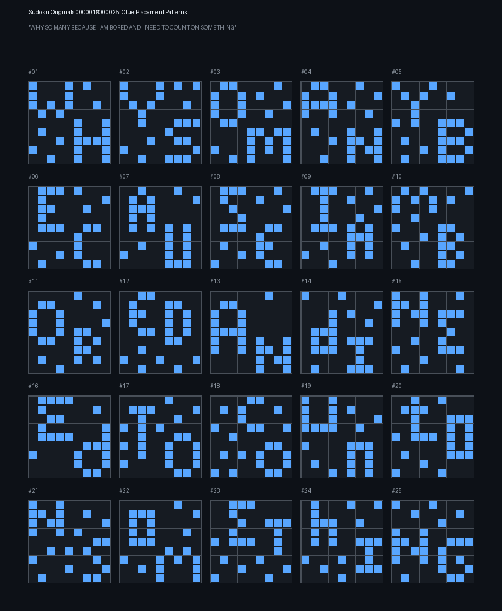

# Original 25 Sudoku Puzzles from onemil.xyz

Every puzzle on [onemil.xyz](https://onemil.xyz) is a transformed copy of one of **25 base puzzles**. This repo contains the recovered originals and all the tools needed to verify them independently.

## The Originals

**[original-25-sudoku.md](original-25-sudoku.md)** — All 25 puzzles with clues and solutions.

The clue patterns (which cells are given vs empty) form pixel-art letters spelling:

> **WHY SO MANY BECAUSE I AM BORED**



---

## How It Works

Each puzzle ID determines two independent transforms:

### 1. Which base puzzle?
```
puzzle_number = ID mod 25    (mod 0 = #25)
```

### 2. What step?
```
step n = ceil(ID / 25)
```

### Transform A: Position permutation (rows, columns, bands, stacks)
- Base-6 odometer with 8 levels controlling row/col/band/stack permutations
- Plus a 90° rotation every *k* steps (k differs per puzzle — see table below)
- Algorithm by Kaleokai + Plurmorant + daddidecember

### Transform B: Digit permutation (relabeling 1→9)
- Each puzzle has its own permutation function
- Period = N! (720 for 8 puzzles, 5040 for 17 puzzles)
- At step n ≡ 1 (mod 5040), the digit permutation is the **identity** (no relabeling)

### Rotation numbers (k) per puzzle

| Puzzle | k | Puzzle | k | Puzzle | k | Puzzle | k | Puzzle | k |
|--------|---|--------|---|--------|---|--------|---|--------|---|
| 1 | 23 | 6 | 58 | 11 | 38 | 16 | 235 | 21 | 26 |
| 2 | 278 | 7 | 25 | 12 | 89 | 17 | 19 | 22 | 59 |
| 3 | 47 | 8 | 67 | 13 | 46 | 18 | 78 | 23 | 28 |
| 4 | 37 | 9 | 149 | 14 | 134 | 19 | 35 | 24 | 57 |
| 5 | 49 | 10 | 257 | 15 | 157 | 20 | 679 | 25 | 269 |

---

## Verification

### Quick check: Identity-point PDFs

At steps where n ≡ 1 (mod period), the digit permutation is the identity — no relabeling. Reversing only the position transform gives the true original (both clue positions AND solution digits).

The `identity-pdfs/` folder contains **49 such PDFs across 7 independent ID ranges:**

| ID Range | n | Identity mod | PDFs |
|----------|---|-------------|------|
| 108001–108025 | 4,321 | mod 720 | 5 (period-720 puzzles only) |
| 252001–252025 | 10,081 | mod 5040 | 25 (all puzzles) |
| 270001–270025 | 10,801 | mod 720 | 8 (period-720 puzzles only) |
| 288001–288025 | 11,521 | mod 720 | 8 (period-720 puzzles only) |
| 612001–612025 | 24,481 | mod 720 | 1 |
| 666001–666025 | 26,641 | mod 720 | 1 |
| 900001–900025 | 36,001 | mod 720 | 1 |

8 puzzles have digit-permutation period 720 (puzzles #2, 9, 10, 14, 15, 16, 20, 25).
The remaining 17 have period 5040.

```bash
npm install
node verify-sudoku.js identity
```

Expected output: **49/49 match ✓**

### Broader check: Sampled PDFs

`sample-pdfs/` contains 200 PDFs (8 per puzzle, spread across the full ID range). For these, reversing the position transform should produce:
- A clue mask matching the original's clue pattern
- A solution that is a consistent digit relabeling (bijection) of the original

```bash
node verify-sudoku.js sample
```

### JSON dataset

`sudoku-grids-sample.json` contains 1000 pre-extracted puzzles (40 per base puzzle) with clues and solutions, for verification without PDF parsing.

### Full dataset

If you have a full PDF collection, point the script at it:

```bash
# In verify-sudoku.js, update pdfDir to your path
node verify-sudoku.js all
```

---

## Verification Results

| Check | Count | Result |
|-------|-------|--------|
| Identity-point PDFs (7 ID ranges) | 49 | 49/49 ✓ |
| Sampled PDFs (positions) | 2,028 | 2,028/2,028 ✓ |
| Sampled PDFs (digit perm consistency) | 2,028 | 2,028/2,028 ✓ |
| Full JSON dataset (positions) | 6,940 | 6,940/6,940 ✓ |
| Full JSON dataset (digit perm consistency) | 6,940 | 6,940/6,940 ✓ |

Zero failures across every test.

---

## Files

| File | Description |
|------|-------------|
| `original-25-sudoku.md` | The 25 original puzzles (clues + solutions) |
| `sudoku-25-originals.png` | Visual clue patterns (pixel-art letters) |
| `verify-sudoku.js` | PDF extraction + solving + transform reversal + verification |
| `generate_originals_image.py` | Position reversal algorithm + image generator |
| `kaleokai_reverse.py` | Core transform functions (Kaleokai's algorithm) |
| `identity-pdfs/` | 49 PDFs at digit-identity points across 7 ID ranges |
| `sample-pdfs/` | 200 PDFs sampled across the ID range (8 per puzzle) |
| `sudoku-grids-sample.json` | 1,000 pre-extracted puzzles for quick verification |

## Community

Join us: **[Serious MrBeast Scavenger Hunters](https://discord.gg/KCtjNMJeYv)** (Discord)

## Credits

- **Kaleokai** — Discovered the base-6 odometer position transform
- **Plurmorant** — Rotation component and verification
- **daddidecember** — Additional verification
- **Community** — 75,000+ PDF collection enabling identity-point discovery
